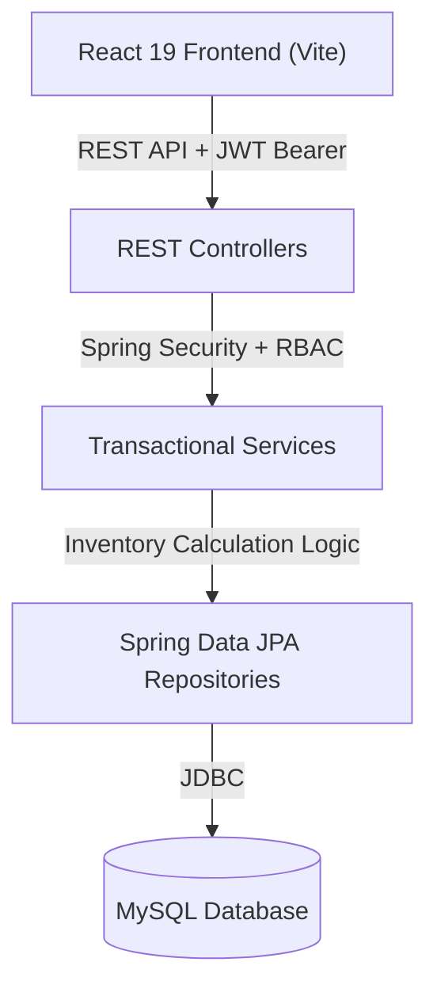

# Military Asset Management System

A role-based, full-stack web application for managing military asset inventory across multiple bases. Built with Java 17, Spring Boot 3, Spring Security, JWT, and React 19, the system provides real-time historical inventory balance reconstruction, atomic inter-base transfers, personnel equipment assignments, expenditure tracking, and audit logging.

---

## 1. Short Project Overview

The **Military Asset Management System** allows military command and logistics personnel to monitor, allocate, and audit equipment across multi-base networks. The application calculates real-time inventory balances from historical transaction ledgers, enforces strict server-side Role-Based Access Control (RBAC) with base-level scoping, and displays operational metrics, stock health status, and itemized net movement audit details.

---

## 2. Key Features

- **Inventory Balance Reconstruction:** Dynamically computes opening balance, net movement, closing balance, and available stock from transaction ledgers without manual balance overrides.
- **Inter-Base Asset Transfers:** Enables atomic asset relocations between military bases with pre-submission confirmation and real-time stock verification.
- **Personnel Asset Assignments:** Tracks equipment assigned to active military personnel by rank and Service ID, accounting for active deployment and returned assets.
- **Expenditure & Loss Accounting:** Records consumed, decommissioned, or written-off equipment linked to general base stock or specific personnel assignments.
- **Stock Health Indicators:** Categorizes operational inventory availability into `HEALTHY`, `LOW STOCK`, and `CRITICAL` statuses.
- **System Audit Trail:** Records immutable audit logs for all security and operational transactions, accessible by authorized commanders and administrators.
- **Role-Based Access Control (RBAC):** Restricts data access and operations based on user roles (`ADMIN`, `BASE_COMMANDER`, `LOGISTICS_OFFICER`) and assigned military base.
- **India Localization:** Formats monetary procurement costs in Indian Rupees (`₹ INR`) using `en-IN` standards and displays operational dates in `DD/MM/YYYY`.
- **Reporting & CSV Export:** Provides client-side CSV export functionality across all operational log views and reporting dashboards.

---

## 3. Technology Stack

### Backend
- **Java 17**
- **Spring Boot 3.3.0** (Spring Web, Spring Data JPA, Spring Security, Validation)
- **JJWT 0.12.5** (JSON Web Token Authentication)
- **MySQL Connector J** / **H2 Database** (In-memory test database)
- **Maven** (Build management)

### Frontend
- **React 19.2**
- **Vite 8.3** (Build tool & development server)
- **React Router DOM 7.18** (Client-side routing & protected routes)
- **Axios 1.20** (HTTP client with JWT request/response interceptors)
- **Lucide React 1.48** (Operational UI icon set)
- **Vanilla CSS3** (Custom design system with dark mode and military green theme)

---

## 4. System Architecture



### Backend Modular Layout
The backend follows a domain-driven modular structure under package `com.militaryasset`:

- `com.militaryasset.module.auth` — User authentication, JWT issuance, and login DTOs.
- `com.militaryasset.module.base` — Base reference data management.
- `com.militaryasset.module.equipment` — Equipment categories, baseline inventory, and stock calculation service.
- `com.militaryasset.module.purchase` — Procurement transaction records and cost accounting.
- `com.militaryasset.module.transfer` — Atomic inter-base asset relocation logic.
- `com.militaryasset.module.assignment` — Personnel equipment assignment tracking.
- `com.militaryasset.module.expenditure` — Consumption and write-off logging.
- `com.militaryasset.module.dashboard` — Metrics calculation, net movement breakdown, and historical date queries.
- `com.militaryasset.module.audit` — Immutable system audit logging.
- `com.militaryasset.security` — JwtTokenProvider, JwtAuthenticationFilter, BaseSecurityService, and UserDetails implementations.

---

## 5. User Roles & Access Control

Access control is enforced **server-side** using Spring Security method security (`@PreAuthorize`) and custom security services (`BaseSecurityService`). Frontend UI checks are strictly presentation-layer aids.

| Role | System Scope | Permitted Operations |
| :--- | :--- | :--- |
| **`ADMIN`** | System-Wide (All Bases) | Full access to all modules, global dashboard metrics, purchases, transfers, assignments, expenditures, audit logs, and base administration. |
| **`BASE_COMMANDER`** | Assigned Base Only | View base-specific dashboard metrics, record purchases, initiate transfers, manage personnel assignments, log expenditures, and view base audit logs. Restricted from accessing other bases' records. |
| **`LOGISTICS_OFFICER`** | Assigned Base / Logistics | Record procurement purchases and initiate inter-base transfers. Restricted from viewing dashboard analytics, personnel assignments, expenditures, and audit logs. |

---

## 6. Core Business Logic

All inventory counts are computed dynamically from transaction ledgers using verified mathematical formulas:

$$\text{Net Movement} = \text{Purchases} + \text{Transfer In} - \text{Transfer Out}$$

$$\text{Closing Balance} = \text{Opening Balance} + \text{Purchases} + \text{Transfer In} - \text{Transfer Out} - \text{Expended Assets}$$

$$\text{Available Stock} = \text{Closing Balance} - \text{Active Assigned Assets}$$

- **Inter-Base Transfers:** Inter-base relocations decrease source base stock and increase destination base stock atomically within a single database transaction (`@Transactional`).
- **Assignment Validation:** Asset assignments are validated against available depot stock to prevent over-allocation.
- **Expenditure Allocation:** Expenditures reduce closing balance directly and can optionally be linked to active personnel assignments.

---

## 7. REST API Overview

| Method | Endpoint | Allowed Roles | Description |
| :--- | :--- | :--- | :--- |
| `POST` | `/api/auth/login` | Public | Authenticates credentials and returns JWT token + user details |
| `GET` | `/api/auth/me` | Authenticated | Fetches current authenticated user profile |
| `GET` | `/api/bases` | Authenticated | Retrieves list of military bases |
| `GET` | `/api/equipment-types` | Authenticated | Retrieves list of equipment categories |
| `GET` | `/api/dashboard/metrics` | `ADMIN`, `BASE_COMMANDER` | Calculates dynamic inventory metrics for date/base/equipment filters |
| `GET` | `/api/dashboard/net-movement-details` | `ADMIN`, `BASE_COMMANDER` | Fetches itemized audit list of transactions forming Net Movement |
| `POST` | `/api/purchases` | `ADMIN`, `BASE_COMMANDER`, `LOGISTICS_OFFICER` | Records new asset procurement transaction |
| `GET` | `/api/purchases` | `ADMIN`, `BASE_COMMANDER`, `LOGISTICS_OFFICER` | Fetches historical procurement records |
| `POST` | `/api/transfers` | `ADMIN`, `BASE_COMMANDER`, `LOGISTICS_OFFICER` | Initiates atomic inter-base asset transfer |
| `GET` | `/api/transfers` | `ADMIN`, `BASE_COMMANDER`, `LOGISTICS_OFFICER` | Fetches historical transfer records |
| `POST` | `/api/assignments` | `ADMIN`, `BASE_COMMANDER` | Assigns equipment to personnel by rank and Service ID |
| `GET` | `/api/assignments` | `ADMIN`, `BASE_COMMANDER` | Fetches active and historical personnel assignments |
| `POST` | `/api/expenditures` | `ADMIN`, `BASE_COMMANDER` | Logs consumed, damaged, or decommissioned assets |
| `GET` | `/api/expenditures` | `ADMIN`, `BASE_COMMANDER` | Fetches historical expenditure records |
| `GET` | `/api/audit-logs` | `ADMIN`, `BASE_COMMANDER` | Fetches system audit trail entries |
| `GET` | `/api/health` | Public | Health check endpoint |

---

## 8. Project Structure

```
Military Asset Management System/
├── backend/
│   ├── pom.xml
│   └── src/
│       ├── main/
│       │   ├── java/com/militaryasset/
│       │   │   ├── MilitaryAssetApplication.java
│       │   │   ├── common/           # DTOs & Global Exception Handling
│       │   │   ├── config/           # SecurityConfig & DataInitializer
│       │   │   ├── module/           # Domain Modules (auth, base, dashboard, equipment, etc.)
│       │   │   └── security/         # JWT Provider, Filters & Security Services
│       │   └── resources/
│       │       └── application.yml
│       └── test/
│           └── java/com/militaryasset/ # Automated Integration & Authorization Tests
├── frontend/
│   ├── index.html
│   ├── package.json
│   ├── vite.config.js
│   ├── .env.example
│   └── src/
│       ├── components/               # Navbar, Sidebar, Alert, LoadingSpinner, ProtectedRoute
│       ├── context/                  # AuthContext (JWT & Session management)
│       ├── layouts/                  # MainLayout shell
│       ├── pages/                    # Dashboard, Purchases, Transfers, Assignments, Expenditures, AuditLogs
│       ├── services/                 # Axios API service instances
│       ├── styles/                   # Design system & dark mode CSS
│       └── utils/                    # Formatters (INR/Date) & CSV Export helper
├── .gitignore
└── README.md
```

---

## 9. Local Setup Instructions

### Prerequisites
- **Java Development Kit (JDK 17 or higher)**
- **Node.js (v18 or higher)** and `npm`
- **MySQL Database Server** (or use default configuration)
- **Maven 3.8+** (or use included wrapper)

### 1. Database Setup
Create a MySQL database instance:
```sql
CREATE DATABASE military_asset_db;
```

### 2. Backend Setup
1. Navigate to the `backend/` directory:
   ```bash
   cd backend
   ```
2. Configure environment variables or edit `src/main/resources/application.yml` defaults.
3. Build and execute tests:
   ```bash
   mvn clean test
   ```
4. Run the Spring Boot backend:
   ```bash
   mvn spring-boot:run
   ```
   *The backend server starts on `http://localhost:8080`.*

### 3. Frontend Setup
1. Navigate to the `frontend/` directory:
   ```bash
   cd frontend
   ```
2. Install Node dependencies:
   ```bash
   npm install
   ```
3. Start the Vite development server:
   ```bash
   npm run dev
   ```
   *The frontend application runs on `http://localhost:5173`.*

---

## 10. Environment Variables

### Backend Environment Variables (`application.yml`)

| Variable | Description | Default Fallback |
| :--- | :--- | :--- |
| `PORT` | Server listening port | `8080` |
| `DB_HOST` | MySQL database host | `localhost` |
| `DB_PORT` | MySQL database port | `3306` |
| `DB_NAME` | Database schema name | `military_asset_db` |
| `DB_USER` | Database username | `root` |
| `DB_PASS` | Database password | `system` |
| `JWT_SECRET` | Secret key for signing JWT tokens | `d29hOTg3Njg3...` *(base64 encoded 256-bit key)* |
| `CORS_ALLOWED_ORIGINS` | Allowed CORS origins (comma-separated) | `http://localhost:5173` |

### Frontend Environment Variables (`frontend/.env.example`)

| Variable | Description | Example Placeholder |
| :--- | :--- | :--- |
| `VITE_API_BASE_URL` | Backend Spring Boot API base URL | `http://localhost:8080` |

---

## 11. Future Improvements

- **Server-Side Pagination:** Implement Spring Data `Pageable` on transaction logs for large-scale datasets.
- **Voucher PDF Generation:** Add automated PDF receipt exports for inter-base transfers and personnel assignments.
- **Alert Notification Engine:** Introduce automated email triggers when equipment stock drops to `CRITICAL` levels.
- **Docker Containerization:** Add `Dockerfile` and `docker-compose.yml` for unified single-command deployment.
